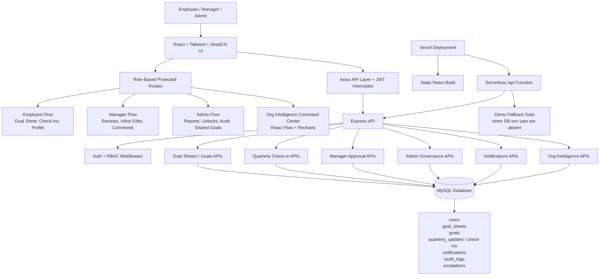

# GoalTrack - Performance Portal

Enterprise goal setting, approval, quarterly check-in, reporting, and organizational intelligence portal for employees, managers, and admins.

## Live Demo

Working link: https://raw.githack.com/Lakshy403/GoalTrack--Performance-Portal/gh-pages/index.html

Backup Vercel link: https://goaltrack-performance-portal.vercel.app

Demo credentials:

| Role | Email | Password |
| --- | --- | --- |
| Admin / HR | `admin@gmail.com` | `Test@1234` |
| Manager | `manager@gmail.com` | `Test@1234` |
| Employee | `employee1@gmail.com` | `Test@1234` |

> The Vercel deployment includes a demo API fallback so the portal remains clickable without exposing a local MySQL database. For full persistence, run the Express + MySQL backend locally or attach a cloud MySQL database and configure environment variables.

## Architecture



## Key Features

- Employee goal sheet creation with thrust area, UoM, target, description, and weightage.
- Backend-enforced validation for maximum 8 goals, minimum 10% goal weightage, and 100% total weightage on submission.
- Manager approval workflow with approve, reject, return for rework, and inline target / weightage edits.
- Goal locking after submission or approval to prevent unauthorized edits.
- Shared goal support with linked KPI badges, read-only title / target for recipients, and editable child weightage.
- Quarterly achievement tracking with planned vs actual achievement.
- Score formulas for Min, Max, Timeline, and Zero-based goals.
- Manager check-in comments for structured review conversations.
- Employee profile page with profile update and password change support.
- Notification center with unread badges and workflow alerts.
- Admin governance tools for audit logs, locked sheet unlocks, escalations, shared goals, and CSV reporting.
- Cascading Goal Graph and Organizational Intelligence dashboard using React Flow and Recharts.
- Demo mode behavior for hosted Vercel access without requiring a public database.

## Tech Stack

- Frontend: React, Vite, Tailwind CSS, ShadCN-style components, Zustand
- Visualization: React Flow, Recharts
- Backend: Node.js, Express
- Database: MySQL with `mysql2` connection pooling
- Auth: JWT with role-based route protection
- Deployment: Vercel

## Local Setup

1. Install frontend dependencies:

```bash
npm install
```

2. Install backend dependencies:

```bash
cd server
npm install
```

3. Configure backend environment:

```bash
cp server/.env.example server/.env
```

Update `server/.env` with your MySQL credentials.

4. Initialize the database:

```bash
mysql -u root -p < database/schema.sql
mysql -u root -p goaltrack_db < database/seed.sql
```

5. Start the backend:

```bash
cd server
npm start
```

6. Start the frontend:

```bash
npm run dev
```

Local app: http://localhost:5173

API health: http://localhost:3001/api/health

## Production Notes

- Vercel link: https://atomsberg-goaltrack.vercel.app
- Static frontend is served by Vercel.
- `/api/*` routes are handled by the serverless API entry in `api/index.js`.
- If `DB_HOST` is configured in Vercel, the API loads the real Express/MySQL backend.
- If database env vars are absent, the hosted build serves seeded demo data for evaluation.

## Evaluation Coverage

| Criteria | Status |
| --- | --- |
| End-to-end portal functionality | Implemented for employee, manager, and admin flows |
| BRD validation rules | Enforced on frontend and backend |
| User friendliness | Role dashboards, toasts, loading states, empty states, responsive layout |
| Bug readiness | Production build verified; key API flows smoke-tested |
| Good-to-have features | Org graph, analytics, notifications, audit logs, escalation demo, Vercel demo mode |
| Cost optimization | Lightweight Express API, pooled MySQL access, Vercel static hosting/serverless API |
